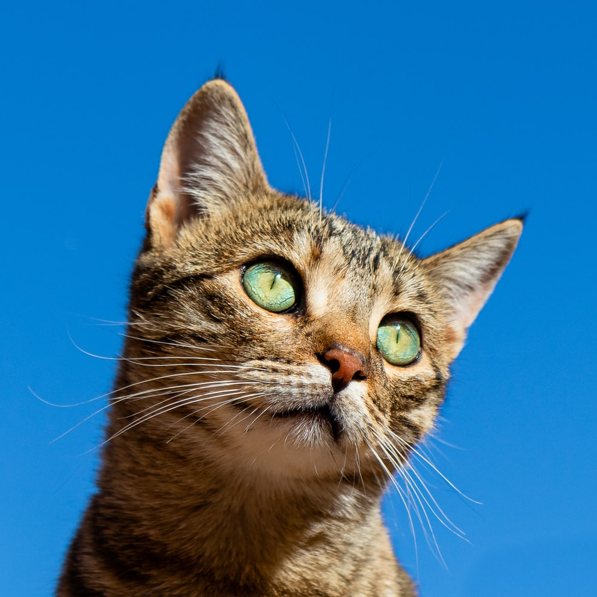

<h1 align="center">Image Digitizer</h1>

Python script to turn images into ascii art

## 📺 Demo

#### Input Image:

#### Output Image:

## 🛠 Built With

- Python3
- Pillow

## 🤝 Support

Give a ⭐️ if you like this project!
